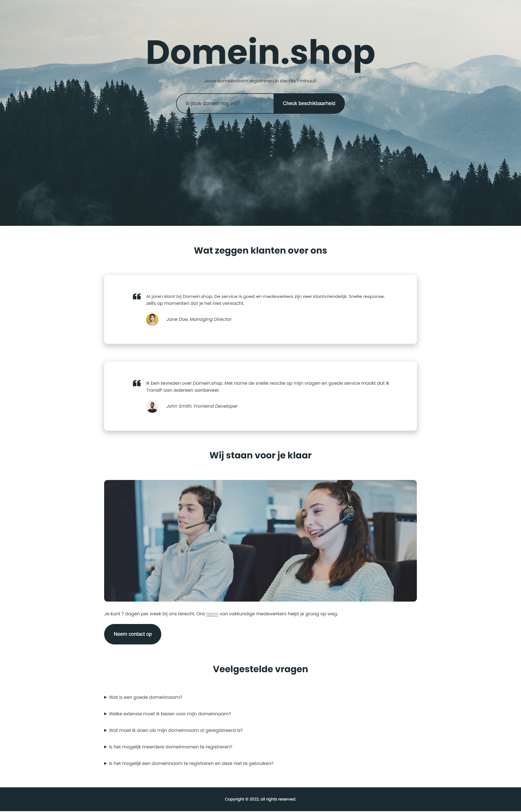

# Opdrachtomschrijving
Via via krijg je een klus aangeboden om de website voor een hosting provider te bouwen. De pagina hoeft nog geen complexe layouts te bevatten en ook nog niet geoptimaliseerd zijn voor mobiele devices. Dat mag van de opdrachtgever in een later stadium gedaan worden.

Je gaat de pagina opbouwen met verschillende `HTML elementen` en de opmaak verzorgen met diverse `CSS properties`. Benieuwd welke er allemaal zijn?
Je vindt hier een overzicht van alle [HTML elementen](https://www.w3schools.com/TAgs/default.asp) en hier een overzicht van alle [CSS properties.](https://www.w3schools.com/cssref/)

Geen zin om te typen? Onderaan in `README` vind je alle dummytekst voor deze opdracht.

## Inhoudsopgave
1. Eindresultaat
2. Randvoorwaarden
3. Stappenplan
4. Dummytekst

## Eindresultaat

## Randvoorwaarden
* Je gebruikt HTML én CSS!
* Gebruik hiervoor de stof die je tijdens de lessen en in edHub hebt bestudeerd.
* Je mag de bestanden (`.css` & `.html`) niet verplaatsen.
* Je gebruikt de afbeeldingen uit de `assets` map.

## Stappenplan
Vind je het lastig om te beginnen? Volg dan het stappenplan.

_TIP_: Kom je er niet helemaal uit? Zoek dan een vergelijkbaar voorbeeld op het internet en bekijk de code die daar is gebruikt.

De opdracht kan opgesplitst worden in drie onderdelen: een `header` een `main` en een `footer`. Het is aan te raden om eerst de HTML te schrijven van de `header` en daarna deze direct op te maken met CSS voor je naar het volgende onderdeel gaat.

### Deel 1: Header
- [ ] Open de `index.html` 

### Deel 2: Main
- [ ] Lorem ipsum dolor sit amet, consectetur adip
- [ ] Lorem ipsum dolor sit amet, consectetur adip

#### 2.1 Testimonial
- [ ] Lorem ipsum dolor sit amet, consectetur adip
- [ ] Lorem ipsum dolor sit amet, consectetur adip

#### 2.2 Support
- [ ] Lorem ipsum dolor sit amet, consectetur adip
- [ ] Lorem ipsum dolor sit amet, consectetur adip

#### 2.3 Faq
- [ ] Lorem ipsum dolor sit amet, consectetur adip
- [ ] Lorem ipsum dolor sit amet, consectetur adip

#### 3 Footer
- [ ] Lorem ipsum dolor sit amet, consectetur adip
- [ ] Lorem ipsum dolor sit amet, consectetur adip

## Dummytekst
> ## Domein.shop
> Jouw domeinnaam registreren in slechts 1 minuut!

> Is jouw domein nog vrij?
> 
> Check beschikbaarheid
-------------------------------------------------------------------------
> ## Wat zeggen klanten over ons
> Al jaren klant bij Domein.shop. De service is goed en medewerkers zijn zeer klantvriendelijk. Snelle response, zelfs op momenten dat je het niet verwacht.
> 
> Jane Doe, Managing Director
> 
> Ik ben tevreden over Domein.shop. Met name de snelle reactie op mijn vragen en goede service maakt dat ik TransIP aan iedereen aanbeveel.
> 
> John Smith, Frontend Developer

-------------------------------------------------------------------------
> ## Wij staan voor je klaar
> Je kunt 7 dagen per week bij ons terecht. Ons team van vakkundige medewerkers helpt je graag op weg.
> 
> Neem contact op
-------------------------------------------------------------------------
> ## Veelgestelde vragen
> - Wat is een goede domeinnaam?
>
> Een goede domeinnaam moet aan enkele eisen voldoen. Ten eerste mag jouw domeinnaam niet in strijd zijn met de openbare orde of de goede zeden. Dit betekent dat je geen ongepaste domeinnaam mag registreren. Verder mag een domeinnaam enkel uit letters, cijfers en eventueel een liggend streepje bestaan. Andere leestekens zijn niet toegestaan.
> 
> - Welke extensie moet ik kiezen voor mijn domeinnaam? 
> 
> Je mag helemaal zelf kiezen welke extensie jouw domeinnaam krijgt. Dit kan een .nl-extensie zijn, maar ook een .be-extensie, een .de-extensie of een .com-extensie. Vraag jezelf af op welke markt je je gaat richten, in het heden én in de toekomst. Ben je niet van plan je business de grens over te brengen? Dan heb je eigenlijk alleen een .nl-domeinnaam nodig. Je kunt andere extensies registreren om te voorkomen dat anderen dit doen, maar deze domeinnamen ga je waarschijnlijk niet zelf gebruiken.
> 
> - Wat moet ik doen als mijn domeinnaam al geregistreerd is? 
> 
> Is de domeinnaam die jij wil registreren, al geregistreerd door iemand anders? Dan kun je deze niet opnieuw registreren. Jouw domeinnaam moet namelijk uniek zijn. Als je gewenste domeinnaam al geregistreerd is, heb je twee mogelijkheden. Ten eerste kun je ervoor kiezen een alternatieve domeinnaam te registreren. Dit kan een domeinnaam zijn die op jouw eerste keuze lijkt, maar ook een heel ander domein. Je vindt vanzelf wel een goede domeinnaam die nog vrij is.
> 
> - Is het mogelijk meerdere domeinnamen te registreren?
> 
> Ja, het is zeker mogelijk meerdere domeinnamen te registreren. Als je zou willen, kun je wel tientallen domeinnamen registreren. Houd er wel rekening mee dat iedere domeinnaam die je registreert, geld kost. Hoe meer domeinnamen je registreert, des te meer geld je moet betalen voor deze domeinen.
> 
> - Is het mogelijk een domeinnaam te registreren en deze niet te gebruiken? 
> 
> Ja, je kunt een domeinnaam registreren zonder deze te gebruiken. Dit gebeurt regelmatig. Ten eerste zijn er veel ondernemers die de domeinnaam van hun nieuwe bedrijf alvast registreren, terwijl ze nog lang geen website hebben. Zij willen simpelweg zeker weten dat de domeinnaam nog beschikbaar is als hun website af is en registreren deze daarom alvast. Verstandig, zeker als je een domeinnaam wil registreren die andere mensen ook interessant kunnen vinden.
>
-------------------------------------------------------------------------
> Copyright © 2022, all rights reserved.